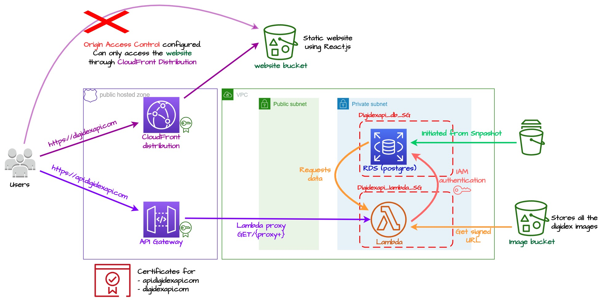

# Digidex API

This project is small personal project to learn how to deploy a simple 3 tiers application using AWS and their CDK. Although it's a small project I tried to implement security at all level, and obviously I kept the costs as low as possible. I couldn't reach a 0$ cost application, because of the public hosted zone (0,50\$/months) and the database master password stored as a secret (0,40\$/month), and of course the domain name (12\$/year). But because the application is mostly serverless (except the DB, but it fall in the free tier), the other costs won't exceed 1\$/month (except if a lot of people use the app).

- Frontend : https://digidexapi.com
- Backend :  https://api.digidexapi.com/digimon

## Architecture

The overall architecture looks like this :



The app is divided in two :
- a frontend part : a basic React.js web app
- a backend part : a web service powered by API gateway and Lambda

### Frontend

The frontend is a simple React.js website stored in a S3 bucket. The bucket is exposed through a CloudFront Distribution configured with Origin Access Control to make the bucket only reachable through the distribution. Because the website use React Router, the error response is configure to route to the root page in case of error 403

### Backend

The backend is powered by API Gateway exposing a Lambda. The data layer is a simple Postgres RDS instance. For security both Lambda and RDS are in a private subnet, so the RDS instance is unreachable from the Internet. To simplify the deployment, the RDS instance is initialize using a snapshot. Moreover the database security group only allow Postgres connection from the Lambda security group. Finally, the database authentication doesn't use password authentication, but IAM authentication. So the Lambda never know the DB's password. The DB generate a temporary credential on request for authorized IAM user/role, then the user/role can access the DB with that credential. The credential has a lifetime of 15 minutes, but when user is connected with it, he won't be disconnected after 15 min, but the credential does not work anymore.
 

> In theory you can store the DB password in Secret Manager and request it in the Lambda. But with a Lambda in a private VPC, you need a VPC endpoint for the Secret Manager or a NAT Gateway. Both solutions are too expensive for this small application. But IAM authentication has a limitation too. If the application required more than 200 connection per second, the IAM authentication can cause connection throttling. I do not expect more than 100 connection per day, so I'm fine.


The web service code is built using [FastAPI ](https://fastapi.tiangolo.com/)for the web service framework, [SQLAlchemy](https://www.sqlalchemy.org/) to communicate with the database and [Mangum](https://mangum.io/) as a event handlers to handle API Gateway event. I choose to only have one API Gateway resource for all the web service and not one by endpoint.  For a small project I prefer to have only one code to maintain. Mangum do not seems to add any overhead compare to the communication with the DB. For the full web service documentation, its Swagger can be find [here](https://api.digidexapi.com/docs) (WIP) 


## What I learned

Using the CDK need some investment. I had to read the documentation every time, and I learned a lot trying and retrying. But at the end it worth the investment because building the infrastructure with python code is simpler and quicker than using the Management Console. Nevertheless, the Management Console is still useful to find the right configuration in the first place. But the best advantage is for deploying multiple times the application. I destroyed and rebuilt my application multiple times and the app was up in less than 10 min.

But for some edge cases the CDK has some issues. Like to enable IAM authentication, the `grant_connect()` method doesn't work. It's explain in the [doc](https://docs.aws.amazon.com/cdk/api/v2/python/aws_cdk.aws_rds/DatabaseInstance.html#aws_cdk.aws_rds.DatabaseInstance.grant_connect) and I used this little "hack"

```python
db_user_arn = f"arn:aws:rds-db:{Stack.of(self).region}:{Stack.of(self).account}:dbuser:*/{db_user}"
iam.Grant.add_to_principal(
    grantee=self.lambda_role,
    actions=["rds-db:connect"],
    resource_arns=[db_user_arn],
)
```

Or for the OAC configuration I overrode some properties manually :

```python
cfn_OAC = cloudfront.CfnOriginAccessControl(
    self,
    ...
)
cfnDistribution = distribution.node.default_child
cfnDistribution.add_property_override(
    "DistributionConfig.Origins.0.S3OriginConfig.OriginAccessIdentity",
    "",
)
cfnDistribution.add_property_override(
    "DistributionConfig.Origins.0.OriginAccessControlId",
    cfn_OAC.get_att("Id"),
)
```

Overall, using the CDK seems to be a good way to learn how AWS services works and how to build an application efficiently !
